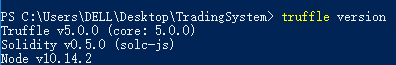

# TradingSystem


<!-- TOC -->autoauto- [TradingSystem](#tradingsystem)auto    - [一、选题背景](#一选题背景)auto    - [二、项目说明](#二项目说明)auto        - [实验环境](#实验环境)auto        - [项目上传说明](#项目上传说明)auto        - [项目涉及内容](#项目涉及内容)auto        - [项目已经实现的功能](#项目已经实现的功能)auto            - [ps:](#ps)auto    - [三、项目环境准备](#三项目环境准备)auto        - [Linux](#linux)auto        - [Windows](#windows)auto            - [node.Js](#nodejs)auto            - [truffle](#truffle)auto            - [ganache](#ganache)auto            - [其他可能问题](#其他可能问题)auto    - [四、创建初始项目](#四创建初始项目)auto    - [五、智能合约说明](#五智能合约说明)auto        - [总体说明](#总体说明)auto        - [Solidity版本](#solidity版本)auto        - [TradingSystem](#tradingsystem-1)auto            - [结构及映射](#结构及映射)auto            - [部分函数说明](#部分函数说明)auto                - [注册与登录 registOrLogin()](#注册与登录-registorlogin)auto                - [增加商品 addGoods()](#增加商品-addgoods)auto                - [删除商品 deleteGoods()](#删除商品-deletegoods)auto                - [发起购买 buyGoods()](#发起购买-buygoods)auto                - [确认购买 confirmPurchase()](#确认购买-confirmpurchase)auto                - [确认收货 confirmReceived()](#确认收货-confirmreceived)auto        - [Purchase](#purchase)auto            - [变量](#变量)auto            - [部分函数说明](#部分函数说明-1)auto                - [确认购买所处的状态](#确认购买所处的状态)auto                - [设置购买的信息 setPurchase()](#设置购买的信息-setpurchase)auto                - [确认购买 confirmPurchase()，](#确认购买-confirmpurchase)auto                - [确认收货 confirmReceived()](#确认收货-confirmreceived-1)auto    - [六、智能合约部署及测试](#六智能合约部署及测试)auto    - [七、Web前端开发](#七web前端开发)auto        - [总体设计思路](#总体设计思路)auto        - [部分函数设计](#部分函数设计)auto            - [获取Web3.provider](#获取web3provider)auto            - [注册与登陆](#注册与登陆)auto            - [删除商品](#删除商品)auto            - [展示自己的商品列表](#展示自己的商品列表)auto    - [八、TradingSystem说明](#八tradingsystem说明)auto        - [用户未登录的界面：](#用户未登录的界面)auto        - [用户登录后的界面（无商品）：](#用户登录后的界面无商品)auto        - [用户登录后的界面（有商品）](#用户登录后的界面有商品)auto        - [用户登录后查看其他用户的商品](#用户登录后查看其他用户的商品)auto        - [用户购买商品后的购买列表](#用户购买商品后的购买列表)auto    - [九、TradingSystem测试](#九tradingsystem测试)auto    - [十、项目总结](#十项目总结)auto        - [所遇问题及解决方法](#所遇问题及解决方法)auto        - [个人感想](#个人感想)autoauto<!-- /TOC -->


## 一、选题背景
区块链是一种分布式、去中心化的计算与存储结构。其具有去中心化、时序数据、集体维护、可编程和安全可信等特点。对于分布式节点来说，由于区块链在每个节点上都有一份完整的数据记录，每条新的交易都要被重新验证，所以区块链解决了不同节点之间的信任问题区块链由成块的交易通过密码学算法连接到一起，使得整个账本公开透明、可追踪、不可篡改。而这种安全性较高底层技术框架也在越来越多的行业得到应用。

DApp是Decentralized Application的缩写，即去中心化应用，也有人称为分布式应用。它被认为开启了区块链3.0时代。DAPP就是在底层区块链平台衍生的各种分布式应用，是区块链世界中的服务提供形式。DAPP之于区块链，有些类似APP之于IOS和Android。

随着电子商务的逐渐发展，由于其节省了客户与企业之间的时间和空间，大大提高了交易效率，越来越多的人选择利用因特网通过第三方电子商务平台进行物品的交易和买卖。但是在目前的大多数平台上，会出现买方与卖方相互不信任的问题。所以这一次期末项目选择做一个基于区块链的远程交易平台。

## 二、项目说明

### 实验环境
在部署合约和之前的阶段是在 Ubuntu 18.04 上进行实现。但是由于在装truffle unbox webpack时一直无法成功，所以将实验迁移到Windows10上进行。

### 项目上传说明
由于库node_modules库太大，所以并没有上传。如果需要测试可以尝试新建一个`truffle unbox webpack`并将相关文件放入代替其中文件即可运行

### 项目涉及内容
本次项目涉及内容及知识较多。在前期需要了解以太坊的安装、私有链创世区块搭建，以及在交易和区块中获取的各种信息的解读。而在后期实现自己的项目时，要创建trffule项目，编写智能合约并部署，通过web3.js与合约进行交互，以及简单的前端web的设计。

### 项目已经实现的功能
1. 用户的注册与登陆
2. 登陆和未登陆用户可以查看所选用户的商品列表
3. 登陆用户可以发布商品
4. 登陆用户可以在界面上看到自己的账户余额并且可以使用按钮更新
5. 登陆用户可以删除自己发布的商品
6. 登陆用户可以查看自己的购买列表

#### ps:
在写选题报告的时候理想过于丰满，在实现的时候发现可能有些许困难，于是放弃了部分功能，只做了最基础的部分。

## 三、项目环境准备
### Linux
Linux下以太坊的安装，私有链创世区块的搭建，合约的部署可参考之前提交的之前提交的[热身报告](https://github.com/dashuibihello/TradingSystem/blob/master/%E7%83%AD%E8%BA%AB%E6%8A%A5%E5%91%8A.pdf)和[合约部署情况](https://github.com/dashuibihello/TradingSystem/blob/master/%E5%90%88%E7%BA%A6%E9%83%A8%E7%BD%B2%E6%83%85%E5%86%B5.pdf)
### Windows
在Windows10上完成制品过程选用Truffle。Truffle是针对基于以太坊的Solidity语言的一套开发框架。本身基于Javascript。其给予开发者许多测试和部署的便利。具体介绍可以通过[TryBlockchain](http://truffle.tryblockchain.org/index.html)来稍微了解。我们现在只用知道其需要通过npm安装，依赖于NodeJS。所以我们需要先安装nodejs给truffle提供环境。
#### node.Js
如果Windows没安装nodejs的可以访问其[官网下载地址](https://nodejs.org/en/download/)下载Windows Installer并根据自身操作系统位数进行安装。


安装完成后，在powershell输入`node -v`和`npm -v`验证安装成功并查看版本


#### truffle
在这里我们用 `npm install -g truffle`进行安装。安装完成后可以在控制台输入`truffle version`验证安装成功以及查看安装版本。在这里我们重点注意Solidity的版本，这里为Solidity v0.5.0，这导致其无法编译v4.x.x的版本的Solidity的文件。而这两个版本部分特性又有较大差别，例如在v0.5.0中区别了`address`和`address payable`。而只有`address payable`拥有transfer和send，只使用address可能导致交易无法进行，所以在编写合约前要进行考虑。



安装具体流程可以查看其[github](https://github.com/trufflesuite/truffle)或网上的博客
#### ganache
由于智能合约必须要部署到链上进行测试。可以选择部署到一些公共的测试链比如Rinkeby或者Ropsten上，缺点是部署和测试时间比较长，而且需要花费一定的时间赚取假代币防止out of gas。

还有一种方式就是部署到私链上，Truffle官方推荐使用以下两种客户端：

- Ganache
- truffle develop

其中truffle develop是truffle内置的客户端，可以通过`truffle develop`启动，并在里面进行合约的编译和部署，其中的命令与truffle console里的相同，需要免去命令前面的truffle。

~~但是本人由于强迫症的原因所以选择了Ganache作为私链。~~
但是本人由于...好吧可能就是觉得比较酷，而且参数设置可能比较方便8（强行解释）


Ganache其实就是TestRpc的一个升级版，truffle已经将其加入其工作套件。

Ganacha有命令行和图像界面两种形式。喜欢GUI的朋友可以前往网上搜索，在这里本人选用Ganache CLI，也就是命令行的版本。这是用JavaScript编写的，并作为Node.js的包通过`npm`分发。值得注意的是，需要node.js版本大于v6.11.5,所以使用Linux的朋友要注意，如果使用系统自带的node.js的版本可能过低，无法正常使用。

在这里通过`npm install -g ganache-cli`进行安装。在安装完成后可以通过，`ganache-cli --version`查看版本并验证安装成功。


具体使用方法及参数控制可上其[github](https://github.com/trufflesuite/ganache-cli/tree/master)查看

#### 其他可能问题
在下一步通过`truffle unbox webpack`创建项目时，在Windows可能出现问题。网上给的大部分解决方法是再进行两个工具的安装，如果出现问题，可以尝试进行以下两条命令进行安装。

	npm install --global--production windows-build-tools  
	npm install --global node-gyp	

~~到这里为止项目前期的环境部署就差不多完成啦，可以愉快的创建项目，编写合约了！~~

## 四、创建初始项目
truffle提供多种模板帮助用户创建自己的项目。如果你想要一个最基本的项目，只需要在一个空文件夹中使用`truffle init`即可。


由下图可以看出其中只有三个文件夹和一个配置文件，提供最基础的合约编译、部署和测试。但这并不是这次项目的重点。


truffle提供了许多项目模板，即truffle box。truffle box装有很多一些实用的项目模板，能让你忽略一些环境配置问题，从而使你能更专注于你的DApp特性开发。此外，truffle box还包含其他有用的组件, Solidity 合约和库, 前后端视图等等。更多可查看[官网](https://truffleframework.com/boxes)。

由于本次项目的是做一个DApp，前端想要用web进行实现。所以选择用webpack模板进行实现。创建项目的过程如下：

	mkdir TradingSystem
	cd TradingSystem
	truffle unbox webpack
如果创建成功，则会出现如下图所示的情况。如果出现问题可以参考[其他可能问题](####其他可能问题)中的解决方法或上网寻找对应方法。


可以看出这次建立的项目里面多了很多的配置文件。其中部分文件说明如下：

- app里就是放置前端设计的文件（html，css，js）

- build是放置合约编译后的文件

- contracts是放置智能合约的文件

- migrations存放合约部署的脚本

- truffle.js是项目的配置文件


然后需要将Contracts中除了Migrations.sol的文件删去。

## 五、智能合约说明

### 总体说明
实现了两个合约，一个是TradingSystem，负责交易系统的基本部分（发布删除商品，注册登录等），另一个是Purchase，负责交易部分的安全性确认。

### Solidity版本

使用的版本是 solidity ^0.5.0

### TradingSystem

#### 结构及映射
定义了两个结构，分别代表商品(Goods)和用户(User)。

	struct Goods {
        string owner;   //商品发布者
        string name;    //商品名
        string information; //商品信息
        uint price; //商品单价
        uint count; //商品数量
    } 

	struct User {
        string name; //用户名
        string password;    //用户密码
        uint goodsCount;    //用户发布的商品数量
        uint purchaseCount; //用户发出购买的数量
        mapping(string => uint) goodsPos;   //用户发布的物品的名称与其在仓库中位置的映射
        mapping(string => bool) goodsFlag;  //物品名称与是否发布的映射
    }

定义了六组映射，用来存放所需要的内容

    mapping(string => bool) usersFlag;  //用户名称与是否发布的映射
    mapping(string => uint) userPos;    //用户名称与其在仓库位置的映射
    mapping(address => string) addressToUser;   //地址到用户名的映射
    mapping(string => Goods[]) userToGoods; //用户名到其物品仓库的映射
    mapping(string => Purchase[]) userToPurchase;   //用户名到其购买列表的映射
    mapping(string => address payable) userToAddress;   //用户名到其地址的映射

#### 部分函数说明

##### 注册与登录 registOrLogin()
用户需要提供用户名和密码来进行注册与登录。函数首先监测消息发送者的地址是否已经注册。若没有则根据用户提供的信息注册，否则将用户之前提供的账户和密码与这次输入的信息进行比对。

    function registOrLogin(string memory name, string memory password) public {
        //判断该地址是否已经注册，如果存在则为登录模式，检查用户名和密码，否则注册一个新用户
        if(usersFlag[addressToUser[msg.sender]] == true) {
            require(stringsEqual(addressToUser[msg.sender], name) == true, "Please input correct username!");
            require(stringsEqual(users[userPos[addressToUser[msg.sender]]].password, password) == true, "Please input correct password!");
        }      
        else {
            require(usersFlag[name] == false, "The name has been used!");
            users.push(User(name, password, 0, 0));
            userPos[name] = userCount;
            userCount++;
            usersFlag[name] = true;
            addressToUser[msg.sender] = name;
            userToAddress[name] = msg.sender;
        }
    }

##### 增加商品 addGoods()
我们可以提供物品的名字，信息，单价，数量来发布一个物品。

	function addGoods(string memory name, string memory information, uint price, uint count) public {
        require(users[userPos[addressToUser[msg.sender]]].goodsFlag[name] == false, "The goods exists!");
        users[userPos[addressToUser[msg.sender]]].goodsPos[name] = users[userPos[addressToUser[msg.sender]]].goodsCount;
        users[userPos[addressToUser[msg.sender]]].goodsFlag[name] = true;
        users[userPos[addressToUser[msg.sender]]].goodsCount++;
        userToGoods[addressToUser[msg.sender]].push(Goods(addressToUser[msg.sender], name, information, price, count));
    }

##### 删除商品 deleteGoods()
我们可以根据商品名称和msg.sender删除发起用户的对应物品。

	function deleteGoods(string memory name) public {           
        userToGoods[addressToUser[msg.sender]][users[userPos[addressToUser[msg.sender]]].goodsPos[name]] = userToGoods[addressToUser[msg.sender]][userToGoods[addressToUser[msg.sender]].length - 1];
        users[userPos[addressToUser[msg.sender]]].goodsPos[userToGoods[addressToUser[msg.sender]][(userToGoods[addressToUser[msg.sender]].length - 1)].name] = users[userPos[addressToUser[msg.sender]]].goodsPos[name];
        delete users[userPos[addressToUser[msg.sender]]].goodsPos[name];
        users[userPos[addressToUser[msg.sender]]].goodsFlag[name] = false;
        userToGoods[addressToUser[msg.sender]].length = userToGoods[addressToUser[msg.sender]].length - 1;
        users[userPos[addressToUser[msg.sender]]].goodsCount--;
    }

##### 发起购买 buyGoods()
用户可以通过物品名，购买数量，和商品所属者购买商品。

    function buyGoods(string memory name, uint count, string memory owner) public {
        require(userToGoods[owner][users[userPos[owner]].goodsPos[name]].count >= count, "The count is not enough");
        userToGoods[owner][users[userPos[owner]].goodsPos[name]].count -= count;
        Purchase newPurchase = new Purchase();
        uint price = userToGoods[owner][users[userPos[addressToUser[msg.sender]]].goodsPos[name]].price;
        newPurchase.setPurchase(userToAddress[owner], msg.sender, name, count, price);
        userToPurchase[addressToUser[msg.sender]].push(newPurchase);
        users[userPos[addressToUser[msg.sender]]].purchaseCount++;
    }

##### 确认购买 confirmPurchase()
在这里可以根据购买在购买列表的位置确认购买，然后调用Purchase.confirmPurchase()确认信息。在这里，买家需要支付与购买物品价值相符的以太币。这些以太币将存入合约的地址中，待买家确认收货后再转给卖家。

	function confirmPurchase(uint x) public payable {
        uint value = msg.value;
        userToPurchase[addressToUser[msg.sender]][x].confirmPurchase(msg.sender, value);  
    }

##### 确认收货 confirmReceived()
在这里可以根据购买在购买列表的位置确认收货，然后调用Purchase.confirmReceived()确认信息。当买家确认收货后，货款将从合约地址转至卖家地址，交易完成
	
    function confirmReceived(uint x) public payable {
        userToPurchase[addressToUser[msg.sender]][x].confirmReceived(msg.sender);
        userToPurchase[addressToUser[msg.sender]][x].getSeller().transfer(userToPurchase[addressToUser[msg.sender]][x].getValue());
    }

### Purchase

#### 变量
声明了如下变量存储该订单的信息

    address payable public seller;  //卖家地址
    address payable public buyer; //买家地址
    uint public value;  //总价
    uint public count;  //商品数量
    uint public price;  //单价
    string public name; //商品名字
    enum State { Created, Locked, Inactive }    
    State public state; //订单状态


#### 部分函数说明

##### 确认购买所处的状态
可以用作后面函数的限制条件之一，在某一状态的购买只能进行某个操作

    modifier inState(State _state) {
        require(
            state == _state,
            "Invalid state."
        );
        _;
    }

##### 设置购买的信息 setPurchase()
根据传递的参数设置该次购买的各种信息，并将状态设置为Created

    function setPurchase (address payable seller_, address payable buyer_, string memory name_, uint count_, uint price_) public {
        seller = seller_;
        buyer = buyer_;
        name = name_;
        count = count_;
        price = price_;
        value = count * price;
        state = State.Created;
    }

##### 确认购买 confirmPurchase()，
要求在Created状态下才可以调用，判断传递的买家地址和用户支付的金额是否与设置的相符，若成功调用则将状态转换为Locked

    function confirmPurchase(address payable buyer_, uint value_) public inState(State.Created) payable {
        require(buyer_ == buyer, "Only buyer can call this");
        require(value_ == value, "You give wrong money");
        state = State.Locked;
    }

##### 确认收货 confirmReceived()
要求在Locked状态下才可以调用，判断是否为买家调用，若成功调用则将状态转换为Inactive

    function confirmReceived(address payable buyer_) public inState(State.Locked) {
        require(buyer_ == buyer, "Only buyer can call this");
        state = State.Inactive;
    }

## 六、智能合约部署及测试

如何在自己的以太坊私有链上部署已经在[合约部署情况](https://github.com/dashuibihello/TradingSystem/blob/master/%E5%90%88%E7%BA%A6%E9%83%A8%E7%BD%B2%E6%83%85%E5%86%B5.pdf)里有了明确是叙述，所以在这里就偷个懒不再重复了。这一阶段使用Ganache-cli作为私有链，并将自己的合约部署上去。
在部署之前，需要修改在migrations文件夹中的2\_deploy_contracts.js和主文件夹中的truffle.js

- 2_deploy\_contracts.js

``` javascript
var TradingSystem = artifacts.require("./TradingSystem.sol");
var Purchase = artifacts.require("./Purchase.sol");

module.exports = function(deployer) {
	deployer.deploy(TradingSystem);
	deployer.deploy(Purchase);
};
```

- truffle.js

``` javascript
module.exports = {
	// See <http://truffleframework.com/docs/advanced/configuration>
	// to customize your Truffle configuration!
	networks: {
		development: {
			host: '127.0.0.1',
			port: 9545,
			network_id: '*',
		}
  	}
};
```

配置完成后就通过`ganache-cli -p 9545`启动客户端并设端口为9545。成功启动后结果如下


启动ganache-cli即可通过`truffle console`进入控制台。


若没启动以太坊客户端就尝试进入控制台会有如下错误


进入控制台后用`compile`编译智能合约


编译完后用`migrate`进行部署


到这里就已经部署成功了！可以尝试在控制台中进行合约的测试了！在这里就展示一个注册和查询的测试，其余测试在之前的[合约部署情况](https://github.com/dashuibihello/TradingSystem/blob/master/%E5%90%88%E7%BA%A6%E9%83%A8%E7%BD%B2%E6%83%85%E5%86%B5.pdf)也有提到，这里就不重复说明了。


通过合约中的getNameByAddress()函数可以查看到这个地址注册的用户名为kiddion


## 七、Web前端开发

到这里合约的部署和测试就已经告一段落，接下来就需要实现前端的界面，让用户通过图形界面与后端进行交互。由于是选用的webpack的模板，所以前端内容就可以在app文件夹中的html，css和js上进行修改了，十分方便。

### 总体设计思路
在前端的设计主要分成两部分。用户部分和商品部分，如下图所示，左边上部是用户的部分，用户登录后左边变成登录用户的信息，而右边是商品的列表。


### 部分函数设计

在这里主要说明部分js的设计


#### 获取Web3.provider
在这里只监听ganache的Web3 provider，而不监听metamask的。很多同学会使用这个插件，我也尝试了一下，感觉确实比较好用。但是在用metamask的时候，使用accounts = web3.eth.getAccounts()时候，accounts[0]是当前选择账户的地址，而由于我太菜，其他账户如何获取我没有找到解决方法，所以在这里只选择监听ganache的，希望有大佬可以指导我一下

	window.web3 = new Web3(new Web3.providers.HttpProvider('http://127.0.0.1:9545'))

#### 注册与登陆

这里根据用户用户输入的信息来进行注册或者登录，并且将用户注册部分隐藏，将用户信息部分设为可见，并将获得的信息加入其中
``` javascript
SigninOrup: function () {
	const self = this
	let name = document.getElementById('username').value
	let password = document.getElementById('password').value
	let account = document.getElementById('account').value
	
	TradingSystem.deployed().then(function (instance) {
		return instance.registOrLogin(name, password, { from: accounts[account], gas:300000 })
	}).then(function (str) {
		document.getElementById('userRegist').className = 'hide'
		document.getElementById('userInformation').className = 'show'
		const Lusername = document.getElementById('Lusername')
		Lusername.innerHTML = name
		const Laccount = document.getElementById('Laccount')
		Laccount.innerHTML = accounts[account]
		userAccount = accounts[account]
		//刷新用户余额
		self.getUserBalance()
		userId = account
		token = true
		document.getElementById('merchants').value = userId
		//刷新物品列表
		self.showOwnGoods();      
	}).catch(function (e) {
		console.log(accounts[0])
		self.setStatus(e)
	})
}
```

#### 删除商品
在删除商品之前需要在确认框输入`DELETE`进行确认
``` javascript
deleteGoods: function (goodsPos) {
	let confirm
	confirm = prompt("Please input DELETE to delete goods!")
	const self = this
	if(confirm === 'DELETE') {
		TradingSystem.deployed().then(function (instance) {
		instance.getGoods(goodsPos, { from: userAccount }).then(function(result) {
			const goodsname = result[0]
			TradingSystem.deployed().then(function (instance) {
			return instance.deleteGoods(goodsname, { from: userAccount, gas:300000 })
			}).then(function (str) {
			self.showOwnGoods();
			}).catch(function (e) {
			alert(e)
			})
		})
		})
	} 
	else {
		alert("Confirm delete error! Please try again!")
	} 
}
```

#### 展示自己的商品列表

先通过合约获取用户商品的数量，然后通过熟悉循环获得商品的信息并动态生成html代码加入id为sellGoods的块中
``` javascript
showOwnGoods: function() {
	let goodsCount = 0;
	document.getElementById('showGoods').innerHTML = ''
	TradingSystem.deployed().then(function (instance) {
		instance.getUserGoodsCount({ from: userAccount }).then(function (goodsCount) {
		for (var i = 0; i < goodsCount; i++) {
					let realNum = Number(i);
			TradingSystem.deployed().then(function (instance) {
			instance.getGoods(realNum, { from: userAccount }).then(function(result) {
				const goodsname = result[0]
				const information = result[1]
				const price = Number(result[2]) / 1000000000000000000
				const count = Number(result[3])
	
				let goodsHtml = '<div class="sellgoods"> \
					<div class="showagoods"> \
					 \
					<label><span class="goodsInformation">Name:</span><p>' + goodsname + '</p></label><br> \
					<label><span class="goodsInformation">Information:</span><p>' + information + '</p></label><br> \
					<label><span class="goodsInformation">Price:</span><p>' + price + '</p></label><br> \
					<label><span class="goodsInformation">Count:</span><p>' + count + '</p></label><br> \
					</div> \
					<button class="deleteGoods" onclick="App.deleteGoods(' + realNum + ')">Delete Goods</button>\
				</div> '
				document.getElementById('showGoods').innerHTML += goodsHtml
			})
			})
		}
		})
	})
}

```

## 八、TradingSystem说明

### 用户未登录的界面：

左边是用户的登录界面。用户可以在两个输入框分别输入用户名和密码并选择下方的选择框选择登录的账户进行登录。


### 用户登录后的界面（无商品）：

左边是用户的信息界面。用户可以输入商品的信息并点击下方的`Add Goods`按钮添加物品。右侧下方的两个选择栏分别是选择查看哪个用户和查看购买还是商品列表。


### 用户登录后的界面（有商品）

用户可以通过商品下方的删除按钮对物品进行删除


### 用户登录后查看其他用户的商品

在这里新建一个用户kiddion1，用其查看eth.accounts[0]的商品。用户可以通过商品下方的购买按钮并输入数量对物品进行购买


### 用户购买商品后的购买列表

在这里对goods1发起三次购买，并且使三次购买分别处于未确认购买，确认购买和确认收货三个阶段。其中确认收货的背景为紫色，底部没有按钮；确认购买的背景为绿色，底部有确认收货的按钮；未确认购买的背景为黄色，底部有确认购买的按钮


## 九、TradingSystem测试

在这里录制了一个[视频](http://v.youku.com/v_show/id_XMzk5MDYyMTA4MA==.html)。视频内容为用户登录后的增加删除商品，用户查看他人的商品列表和用户进行购买等内容。视频可以通过前方链接或在[github](https://github.com/dashuibihello/TradingSystem)上下载


## 十、项目总结

### 所遇问题及解决方法
1. 一开始在Linux上调用合约的时候有时无法执行。此时有可能gas的问题，可以在参数中加上{gas:xxxxxx}来设置一个合理的gas。
2. 在以太坊上直接调用合约的时候，合约没有正常执行。原因是要修改区块内容的合约要用sendTransaction进行调用，并且之后要进行挖矿后才能查看到上一次部署到链上的信息。
3. 在Linux上用truffle unbox webpack的时候一直卡在setting处，但是在windows上就可以很快部署，所以将前端开发转到Windows上进行。
4. 在Windows上部署合约的时候会出现out of gas的情况。可以将所写合约简化或者设置gas limit解决。
5. 一开始尝试用metamask这个插件，但是如果这个插件启动会导致web3.eth.getAccounts()只有当前用户的地址，导致前端js的功能不能正常使用，所以放弃了使用这个插件。
6. 由于在solidity v0.5.0中address和address payable有明确的区分，但是在编写合约的时候没有考虑到，导致本来应该在Purchase中的transfer要在TradingSystem中进行，而Purchase只做信息的核实功能

### 个人感想

说实话，在开始做这次项目的时候真的感觉一筹莫展，感觉自己啥都不会就要做一个DApp出来（特别之前web课学的也不好）。在做的时候也时常感到烦躁，因为真的很多时候并不是代码写不出来，而是环境的配置以及对整个环境的不了解所导致的，并且这个东西也是一个相对于来说比较新，接触的比较少的东西，所以要在网上找到正确的解决办法也是需要一定时间的。但后面做着做着就慢慢地熟悉了，对于一些特性有了一定的了解，问题出现的时候有了寻找的目标，可以更快的解决出现的bug了。不过自己确实和各位大佬比还是差了挺多的，就比如说在TradingSystem里面的数据结构过于复杂，各种映射与结构体交互，使代码的可读性大大下降，也加大了编写和debug的难度。在以后设计数据结构的时候一定要提前规划好，而不是要用一个加一个。前端做的也挺丑的，也没有用什么框架，还是实名羡慕各位大佬的强大。最后就终于做完了，可以睡个好觉了。